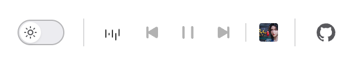

# vuepress-music-player

VuePress 1.x 音乐播放器插件，TypeScript 编写，支持导航栏集成、全局/页面级播放列表与自动播放。



## 特性

- 导航栏右侧显示播放器图标（位于主题切换按钮左侧）
- 默认显示动态均衡器动画（基于 `playing.svg` 的 CSS 动画）
- Hover 展开控制按钮：上一首 / 播放暂停 / 下一首 / 封面
- 全局播放列表 + 全局自动播放配置
- 页面 frontmatter 可覆盖播放列表与自动播放
- `link` / `cover` 支持相对路径、http、https

## 项目结构

```
src/
  index.ts              # 插件入口（Node 端，构建时运行）
  types.ts              # 类型定义
  lib/normalize.ts      # 播放列表/URL 规范化
  client/               # VuePress 客户端代码（浏览器端，由 VuePress webpack 打包）
    enhanceAppFile.js   # 注册全局组件
    MusicPlayer.vue     # 播放器主组件
    components/         # 图标组件
    assets/images/      # SVG 图标资源
dist/                   # 构建产物（发布到 npm）
tests/                  # 单元测试
```

VuePress 插件分两层：`src/index.ts` 在站点**构建时**执行；`src/client/` 在**浏览器**中运行，因此构建时需复制到 `dist/client/`。

## 安装

```bash
npm install vuepress-music-player
```

## 全局配置

```js
// docs/.vuepress/config.js
module.exports = {
  plugins: [
    [
      require('vuepress-music-player'),
      {
        enabled: true,
        autoplay: true,
        musicList: [
          {
            title: 'Mojito',
            link: '/music/Mojito.mp3',
            cover: '/imgs/Mojito.jpg'
          },
          {
            title: 'Remote BGM',
            link: 'https://example.com/music/bgm.mp3',
            cover: 'https://example.com/images/cover.jpg'
          }
        ],
        navbar: {
          insertIntoNav: true,
          fallbackRight: '7.5rem'
        }
      }
    ]
  ]
}
```

### TypeScript 配置示例

```ts
// docs/.vuepress/config.ts
import musicPlayer from 'vuepress-music-player'
import type { MusicPlayerOptions } from 'vuepress-music-player'

const musicOptions: MusicPlayerOptions = {
  enabled: true,
  autoplay: false,
  musicList: [
    {
      title: 'BGM',
      link: 'https://cdn.example.com/bgm.mp3',
      cover: 'https://cdn.example.com/cover.jpg'
    }
  ]
}

export default {
  plugins: [[musicPlayer, musicOptions]]
}
```

### 配置项

| 选项 | 类型 | 默认值 | 说明 |
|------|------|--------|------|
| `enabled` | `boolean` | `true` | 是否启用插件 |
| `autoplay` | `boolean` | `false` | 全局自动播放 |
| `musicList` | `MusicItem[]` | `[]` | 全局歌曲列表 |
| `navbar.insertIntoNav` | `boolean` | `true` | 是否插入导航栏 |
| `navbar.fallbackRight` | `string` | `'7.5rem'` | 无法插入导航栏时的 fixed 定位 |

### 歌曲对象

```ts
interface MusicItem {
  title: string
  link: string    // 相对路径 / http / https
  cover?: string  // 相对路径 / http / https
}
```

## 页面级配置

```yaml
---
music:
  autoplay: true
  list:
    - title: 页面专属 BGM
      link: https://example.com/music/page-bgm.mp3
      cover: https://example.com/imgs/cover.jpg
---
```

## 图标资源

图标位于 `src/client/assets/images/`，构建时会复制到 `dist/client/assets/images/`：

| 文件 | 用途 |
|------|------|
| `icon.svg` | 暂停态默认图标 |
| `playing.svg` | 播放态均衡器（`PlayingIcon.vue` 内联 + CSS 动画） |
| `play.svg` / `stop.svg` | 播放 / 暂停按钮 |
| `last.svg` / `next.svg` | 上一首 / 下一首 |

静态图标通过 `SvgImgIcon` 组件 `require()` 直接引用 SVG 文件；`playing.svg` 因需逐柱动画，在 `PlayingIcon.vue` 中基于该文件路径数据内联渲染。

## 开发

```bash
npm install
npm test
npm run build
```

## 发布

与 [beam-overlay](https://github.com/chenzikun/beam-overlay) 相同，通过 tag 触发 CI 发布：

```bash
npm version patch
git push --follow-tags
```

需在 GitHub Actions 中配置 `NPM_TOKEN`。

## 兼容

- VuePress `^1.9.0`
- Node.js `>=18`
